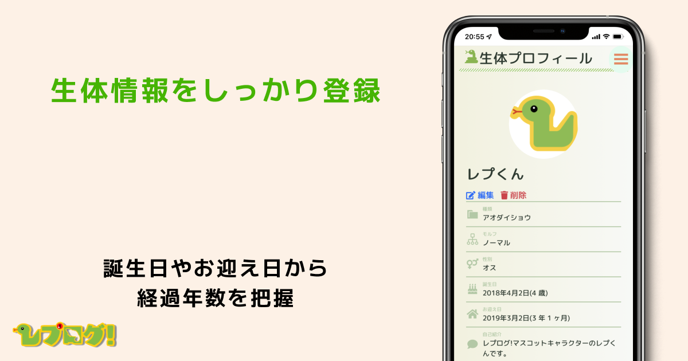
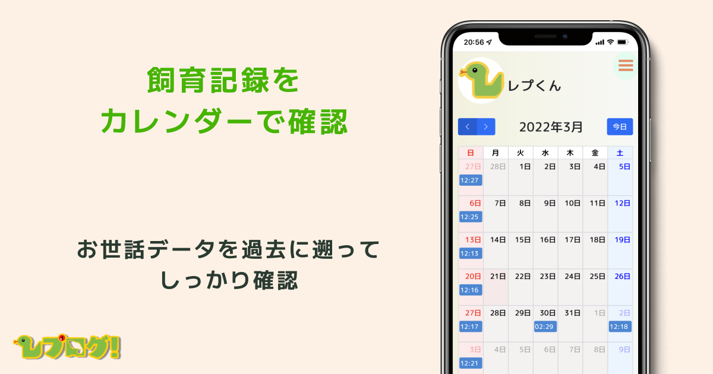

# レプログ!

【https://reptileslog.com/】
## サービス概要
爬虫類飼育者のためのかんたん飼育記録サービス

## 機能
### 生体登録

### 飼育記録

### 飼育タイムライン

### カレンダー

### グラフ

## 使用技術
## バックエンド
- Ruby 3.0.3
- Ruby on Rails 6.1.4

## フロントエンド
- JavaScript
- jQuery

## インフラ
- Heroku
- AWS S3

## 主要なライブラリ
- FullCalendar
- Chart.js

## 使用API
- Google Calendar API

## ER図

## その他
[公式Twitter](https://twitter.com/reptileslog)